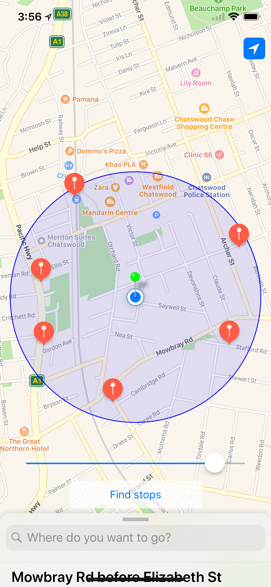
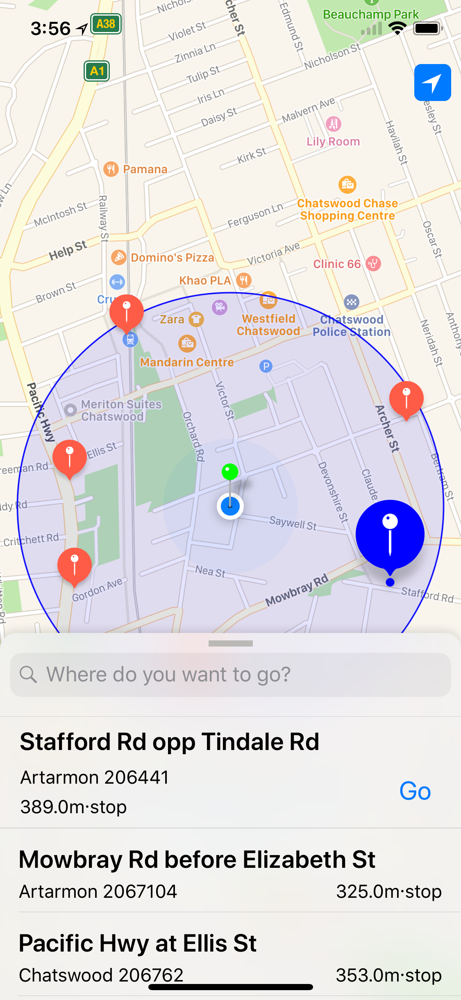
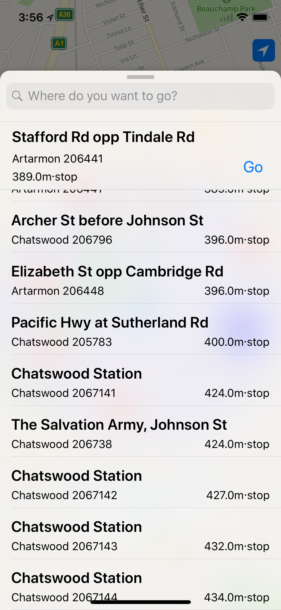
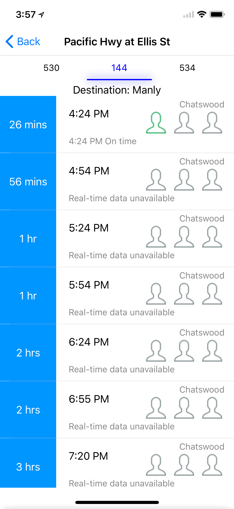

# TripNow

Uses TFNSW Trip Planner API to find bus stops and train station platforms within some specified radius. 

Queries TFNSW endpoint /coord to obtain stops around some coordinate, and /departure_mon to obtain detailed attributes of a particular stop.
Searches made in the search bar use /stop_finder endpoint

## Features
* Drag user annotation
* Tweak search radius
* User location
* Centre in on user annotation
* Search for a place

The app presents data such as:
* Closest stops
* Name of each stop
* Suburb stop belongs in
* Distance to each stop
* Buses at a particular stop
* Planned departure time

And also real-time data:
* Bus estimated departure time
* Bus capacity

## Screenshots

  
  
  
  

## Libraries
Pulley for iOS 10 Maps style pull up modal.

EHHorizontalSelectionView for horizontal list of buses at a stop.

## Supported devices
Currently only supports iOS 11 due to the use of MKMarkerAnnotationView

## To do
[x] Search a region

[x] Long press to set position of user's search coordinate

[ ] Find out a sequence of transport to take to get to a specified searched region

[ ] Fix StopInfoViewController to update waiting time
